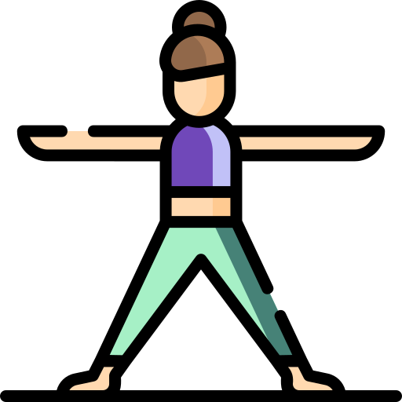

# Active lifestyle 

A project created by Aleksandra Haniok as part of Skillshare course 'The Basics of Web-Design Layout: Learn How To Describe Your Design With HTML & CSS'.

[Visit live website](https://aleksandracodes.github.io/activelifestyle)

